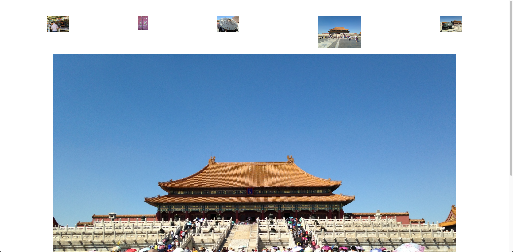

# alligator-zest --- a repo for teaching Vue Template Syntax



## Vue Template Syntax

**Vue** is best used when using its templating features. It becomes very intuitive to build fancy user interfaces.

Take its "directives", which refers to tag attributes with the `v-` prefix.

You could have a variable `url` in your Vue instance that your anchor tag uses as its `href`. That would look like this:

`<a v-bind:href="url"></a>`

Let's try it with the other directive that we will find ourselves using a lot:

`<a v-on:click:"myFunction"></a>`

That is how we would call one of our component's functions upon clicking the link.

---

Dynamic arguments take your directives to a new level. Consider the following:

`a v-bind:[attributeName]="url">...</a>`

`attributeName` is itself a Javascript expression like `url`, interpreted as such because of the square brackets around it.

 `<a v-on:[event]="myFunction"></a>` would mean that the event variable could be `"hover"` or `"click"` or any other attribute used with `v-on`.

---

Let's go over one more thing.

The directives `v-on` and `v-bind` are so common that we have shortcuts for writing them in Vue; `:` and `@`.

So, an `img` tag with a dynamic attribute could be `` where `display` is a function, `value` is a string variable, and `classOrId` is also a string variable.

---

Today we are going to create a photo gallery with some of this new fangled syntax. Get ready!

## Coding

### Setup

Start by running either
```bash
$ npm install -g @vue/cli
```
or
```bash
$ yarn global add @vue/cli
```
in your Terminal.

Now you will be able to run the `vue` command from the command line. Let us create a Vue application called alligator-zest.
```bash
$ vue create alligator-zest
$ cd alligator-zest
$ npm run build
$ npm run serve
```

---

We're going to change `HelloWorld.vue` to be `PhotoGallery.vue`. `App.vue` should look something like this:

<p class="file-desc"><span>App.vue</span></p>

```vuejs
<template>
  <div id="app">
    <PhotoGallery/>
  </div>
</template>

<script>
import PhotoGallery from './components/PhotoGallery.vue'

export default {
  name: 'App',
  components: {
    PhotoGallery
  }
}
</script>

<style>
#app {
  font-family: Avenir, Helvetica, Arial, sans-serif;
  -webkit-font-smoothing: antialiased;
  -moz-osx-font-smoothing: grayscale;
  text-align: center;
  color: #2c3e50;
  margin-top: 60px;
}
</style>
```

`PhotoGallery.vue` is where we're about to get fancy while keeping things simple at the same time.

### Building our gallery

Let's assume we have 5 photo files in the `assets/photos` folder named `1.jpeg` through `5.jpeg`. Use any images you want.

<p class="file-desc"><span>PhotoGallery.vue</span></p>

```vuejs
<template>
  <div>
    <ul class="gallery">
      <li v-for="n in 5" :key="n">
        
      </li>
    </ul>
  </div>
</template>

<script>
export default {
  name: 'PhotoGallery'
}
</script>

<style scoped>
ul {
  list-style-type: none;
  padding: 0;
}
li {
  display: inline-block;
  margin: 0 10px;
}
.gallery {
  display: flex;
  justify-content: space-around;
}
img {
  width: 20%;
}
</style>
```

<p class="info-box">The `@` symbol is a Webpack alias that points to the `src` folder.</p>

Note the `display: flex` on `"gallery"` as well as the `v-for` in the `<li>` tag. You should be able to see the app in your browser at `localhost:8080`.

Let's update this code so that when we click on a photo it is enlarged.

<p class="file-desc"><span>PhotoGallery.vue</span></p>

```vuejs
<template>
  <div>
    <ul class="gallery">
      <li v-for="n in 5" :key="n">
        
      </li>
    </ul>
  </div>
</template>

<script>
export default {
  name: 'PhotoGallery'
},
methods: {
  highlight() {
    event.target.id = "theater";
    let eventIterator = event.target.parentNode;
    while (eventIterator.previousElementSibling != null) {
      eventIterator.previousElementSibling.getElementsByTagName('img')[0].id = "";
      eventIterator = eventIterator.previousElementSibling;
    }
    eventIterator = event.target.parentNode;
    while (eventIterator.nextElementSibling != null) {
      eventIterator.nextElementSibling.getElementsByTagName('img')[0].id = "";
      eventIterator = eventIterator.nextElementSibling;
    }
  }
}
</script>

<style scoped>
ul {
  list-style-type: none;
  padding: 0;
}
li {
  display: inline-block;
  margin: 0 10px;
}
.gallery {
  display: flex;
  justify-content: space-around;
}
img {
  width: 20%;
}
#theater {
  width: 40%;
}
</style>
```

We added a `v-on:click` to each image that sets off the `highlight()` method. This method makes the image that is clicked on become larger while ensuring that the others are thumbnail sized.


<gator-collapse title="How does it do it?!">
  <p>It sets the id of the clicked image to "theater" which has a larger width. Then, it gets the sibling nodes of the parent node of the image, the li with the v-for in it. It goes into all of these li tags and sets their respective img tag's id to a null string to make sure that only one img has the "theater" id at any given time.</p>
</gator-collapse>

This is cool but it is still not  what we see on the web; how can we get the enlarged image to be a big display, say, under the 5 thumbnails? The end result would be a roll of thumbnails with the selected image enlarged to a real theater size right below. Sounds good, right?

---

We're going to add the following:

```html
<div id="frame">
  
</div>
```
<pre><code class="javascript">
data() {
  return {
    theatrical: ""
  }
},
methods: {
	highlight() {
    	event.target.id = "theater";
    	<span class="code-annotation">this.theatrical = event.target.src;</span>
</code></pre>

And finally, add the following to your CSS.

<pre><code class="css">
#frame img {
  width: 80%;
}
</code></pre>

<p class="info-box success">
	Check it out in your browser!
</p>

The big frame is filled up by the photo that you clicked on since its `src` gets set when you click. Now you have a nice gallery view of your photos!

All with some nifty use of Vue's reactivity system, data properties, and template syntax 🧪

---

## Custom Events

`v-on:click`. `v-on:hover`. We know those from [Vue Template Syntax](https://alligator.io/vuejs/vue-template-syntax/). `v-on` allows us to listen for `click` or `hover` events that occur on a particular tag and, as a result, fire off a particular function. If `someFunction` was defined in the `methods` section of our component, we could use `v-on:click=someFunction` in our template. **Vue.js** also allows you to listen for **custom events**, which has its most important usecase in allowing child components to fire off events that parent components can listen for.

In [Vue Template Syntax](https://alligator.io/vuejs/vue-template-syntax/) we created a photo gallery component. You could click any of the photos in a row of thumbnails and the photo you clicked on would be displayed in a large size below. Now, what if we wanted the background of the entire page to be set to the average color of the photo being displayed in a large size? We could call this "theater mode" for fun.

To do this, the parent component of the photo gallery, `App.vue`, would need to be receive the average RGB value of the photo from its child component, `PhotoGallery.vue`, when the photo is clicked.

This is the power of custom events.

Let's get started. If you did the Template Syntax tutorial you already have all of the code in the **Setup** section of this tutorial.

## Setup

Start by running either
```bash
$ npm install -g @vue/cli
```
or
```bash
$ yarn global add @vue/cli
```
in your Terminal.

Now you will be able to run the `vue` command from the command line. Let us create a Vue application called alligator-zest.

```bash
$ vue create alligator-zest
$ cd alligator-zest
$ npm install fast-average-color
$ npm run build
$ npm run serve
```

You should be able to see a barebones Vue app in your browser.
---
We're going to change `HelloWorld.vue` to be `PhotoGallery.vue`.

<p class="file-desc"><span>PhotoGallery.vue</span></p>

```vuejs
<template>
  <div>
    <ul class="gallery">
      <li v-for="n in 5" :key="n">
        
      </li>
    </ul>
    <div id="frame">
      
    </div>
  </div>
</template>

<script>

export default {
  name: 'PhotoGallery',
  data() {
    return {
      theatrical: ""
    }
  },
  methods: {
    highlight() {
      event.target.id = "theater";
      var that = this;
      this.theatrical = event.target.src;
      let eventIterator = event.target.parentNode;
      while (eventIterator.previousElementSibling != null) {
        eventIterator.previousElementSibling.getElementsByTagName('img')[0].id = "";
        eventIterator = eventIterator.previousElementSibling;
      }
      eventIterator = event.target.parentNode;
      while (eventIterator.nextElementSibling != null) {
        eventIterator.nextElementSibling.getElementsByTagName('img')[0].id = "";
        eventIterator = eventIterator.nextElementSibling;
      }
    }
  }
}
</script>

<style scoped>
h3 {
  margin: 40px 0 0;
}
ul {
  list-style-type: none;
  padding: 0;
}
li {
  display: inline-block;
  margin: 0 10px;
}
a {
  color: #42b983;
}
.gallery {
  display: flex;
  justify-content: space-around;
}
#frame img {
  width: 80%;
}
img {
  width: 20%;
}
#theater {
  width: 40%;
}
</style>
```

 `App.vue` should look like this:

<p class="file-desc"><span>App.vue</span></p>

```vuejs
<template>
  <div id="app">
    <PhotoGallery/>
  </div>
</template>

<script>
import PhotoGallery from './components/PhotoGallery.vue'

export default {
  name: 'App',
  components: {
    PhotoGallery
  }
}
</script>

<style>
#app {
  font-family: Avenir, Helvetica, Arial, sans-serif;
  -webkit-font-smoothing: antialiased;
  -moz-osx-font-smoothing: grayscale;
  text-align: center;
  color: #2c3e50;
  margin-top: 60px;
}
</style>
```
---

## Let's write some code

We're going to use an `npm` library called `fast-average-color` to get the average color value for a particular photo. At the top of the `script` section of `PhotoGallery.vue` let's import FastAverageColor.

<pre><code class="javascript">
import from 'fast-average-color';
</code></pre>

`PhotoGallery` has a method `highlight` which is triggered by clicking on an image. Let's add our color averaging logic to the end of the `highlight` method. We already used `event.target` in that method. The value of `event.target` is the element that was clicked on. The image we want to get the average color of.

By perusing the `fast-average-color` docs, we can find the `getColorAsync` function, which returns a color object. Ultimately, we can access the average rgb value of via `color.rgba`. 

<pre><code class="javascript">
const fac = new FastAverageColor();
fac.getColorAsync(event.target)
    .then(function(color) {
    })
    .catch(function(e) {
        console.log(e);
    });
</code></pre>

We need to do something with the value `color.rgba`; in `App.vue` we need to set the background color to that value. Let's not yet worry about how the value gets to `App.vue`. Let's assume that it will and let's write the method in `App.vue` which takes `rgba` as a parameter and sets the background color.

<pre><code class="javascript">
methods: {
  setBackground(rgba) {
    document.querySelector('body').style.backgroundColor = rgba;
  }
}
</code></pre>

That should look good to you!

Now, let's look at the template section of this file.

```html
<template>
  <div id="app">
    <PhotoGallery />
  </div>
</template>
```

We need the `App` component to pick up an event from the `PhotoGallery` component. Let's call our event `theater-mode`. If we want to listen for an event in our component, the syntax is just like for regular events. That is: `v-on:theater-mode`. We want to call our `setBackground` method whenever that event occurs.

Let's head back to `PhotoGallery.vue` where we need to send `App.vue` the value `color.rgba`.

Every Vue component has a method `$emit` which allows you to trigger an event, in our case one called `theater-mode`. We're going to call `this.$emit` inside the `then` function from earlier. Let's jog your memory.

<pre><code class="javascript">
highlight() {
  event.target.id = "theater";
  this.theatrical = event.target.src;
  let eventIterator = event.target.parentNode;
  while (eventIterator.previousElementSibling != null) {
    eventIterator.previousElementSibling.getElementsByTagName('img')[0].id = "";
    eventIterator = eventIterator.previousElementSibling;
  }
  eventIterator = event.target.parentNode;
  while (eventIterator.nextElementSibling != null) {
    eventIterator.nextElementSibling.getElementsByTagName('img')[0].id = "";
    eventIterator = eventIterator.nextElementSibling;
  }
  const fac = new FastAverageColor();
  fac.getColorAsync(event.target)
      .then(function(color) {
      })
      .catch(function(e) {
          console.log(e);
      });
}
</code></pre>

`this.$emit` takes the event name as its first argument and has optional further arguments in which you can pass data. We will pass `color.rgba`. So our function call is going to look like `this.$emit('theater-mode', color.rgba)`. Since it is going to go in that `then` function, the `this` keyword may no longer refer to our Vue component as it normally does. So we're also going to add one more simple line at the beginning of the `highlight` function. Here's our new function:

<pre><code class="javascript">
highlight() {
  event.target.id = "theater";
  var that = this;
  this.theatrical = event.target.src;
  let eventIterator = event.target.parentNode;
  while (eventIterator.previousElementSibling != null) {
    eventIterator.previousElementSibling.getElementsByTagName('img')[0].id = "";
    eventIterator = eventIterator.previousElementSibling;
  }
  eventIterator = event.target.parentNode;
  while (eventIterator.nextElementSibling != null) {
    eventIterator.nextElementSibling.getElementsByTagName('img')[0].id = "";
    eventIterator = eventIterator.nextElementSibling;
  }
  const fac = new FastAverageColor();
  fac.getColorAsync(event.target)
      .then(function(color) {
          that.$emit('theater-mode', color.rgba);
      })
      .catch(function(e) {
          console.log(e);
      });
}
</code></pre>

That should look good to you! We saved a pointer to our Vue component to use later.

Let's look back at `App.vue`.

<p class="file-desc"><span>App.vue</span></p>

```vuejs
<template>
  <div id="app">
    <PhotoGallery/>
  </div>
</template>

<script>
import PhotoGallery from './components/PhotoGallery.vue'

export default {
  name: 'App',
  components: {
    PhotoGallery
  },
  methods: {
    setBackground(rgba) {
      document.querySelector('body').style.backgroundColor = rgba;
    }
  }
}
</script>

<style>
#app {
  font-family: Avenir, Helvetica, Arial, sans-serif;
  -webkit-font-smoothing: antialiased;
  -moz-osx-font-smoothing: grayscale;
  text-align: center;
  color: #2c3e50;
  margin-top: 60px;
}
</style>
```

We already discussed that listening to the `theater-mode` event looks like `v-on:theater-mode`. What should `v-on:theater-mode` `=`? Definitely `setBackground`. But how about accessing the color value that we passed in `PhotoGallery.vue`? That brings us to our final piece of syntax. When we listen for a custom event, we can access any data that is passed with it via `$event`.

So, we write the following:

```html
<template>
  <div id="app">
    <PhotoGallery v-on:theater-mode="setBackground($event)"/>
  </div>
</template>
```

Check back to your browser and congratulations!

## Project setup
```
npm install
```

### Compiles and hot-reloads for development
```
npm run serve
```

### Compiles and minifies for production
```
npm run build
```

### Run your tests
```
npm run test
```

### Lints and fixes files
```
npm run lint
```

### Customize configuration
See [Configuration Reference](https://cli.vuejs.org/config/).
